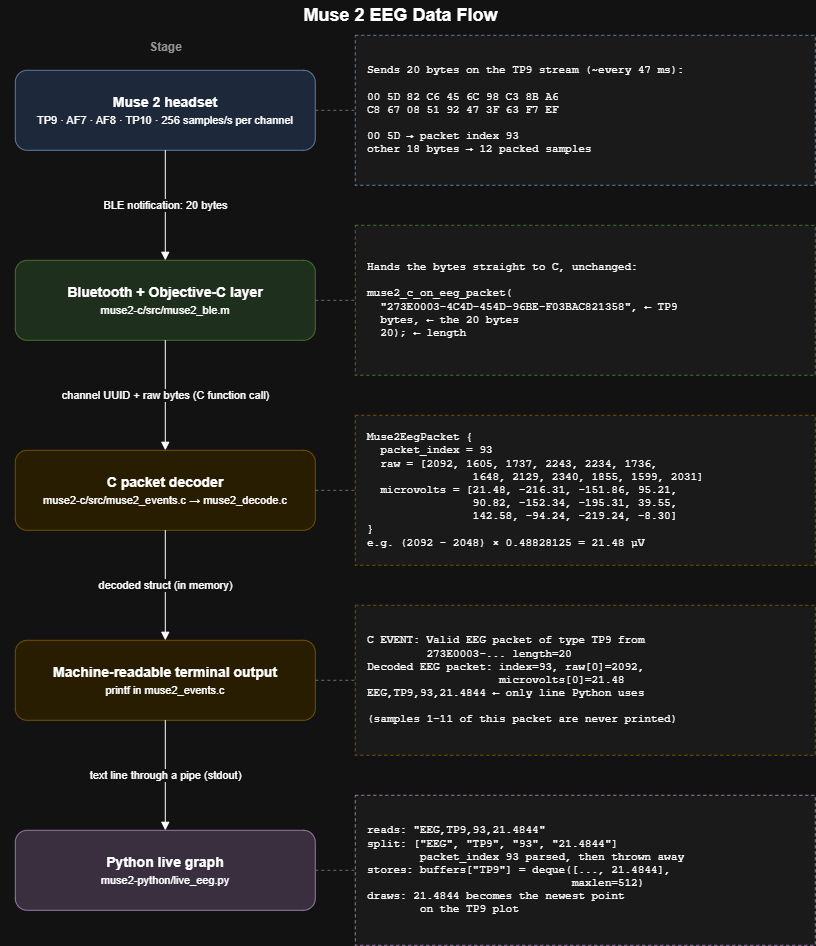

# Recording Data Draft

A first draft of how live Muse 2 EEG output could be saved as a session and read back later. This week uses **synthetic data only**. No headset, Bluetooth, or participant recordings were used.

Related files:

- [`scratch/benjamin/synthetic_eeg.csv`](../scratch/benjamin/synthetic_eeg.csv): a small synthetic session in the proposed format
- [`scratch/benjamin/read_synthetic_session.py`](../scratch/benjamin/read_synthetic_session.py): a standard-library script that validates and summarizes it

No existing C or Python streaming code was changed.

---

## Part 1: Current data flow

### Pipeline diagram



The diagram follows one real packet (from `muse2-c/tests/test_decode.c`) through every stage. The same path in text form:

```text
Muse 2 headset
    ↓  Bluetooth Low Energy notifications (20 bytes each, one stream per channel)
Bluetooth and Objective-C layer        muse2-c/src/muse2_ble.m
    ↓  channel UUID + raw 20-byte packet (function call)
C packet decoder                       muse2-c/src/muse2_events.c, muse2_decode.c
    ↓  packet index + 12 raw values + 12 microvolt values (in memory)
Machine-readable terminal output       muse2-c/src/muse2_events.c (printf)
    ↓  text line "EEG,<channel>,<packet_index>,<microvolts>" (pipe to Python)
Python live graph                      muse2-python/live_eeg.py
    ↓
Rolling plots on screen (nothing written to disk)
```

### Stage by stage

#### 1. Muse 2 headset

- **In:** electrical activity at four electrodes (TP9, AF7, AF8, TP10).
- **Out:** Bluetooth notifications. Each channel has its own characteristic (stream). Every notification is 20 bytes: a 16-bit packet index followed by 12 packed 12-bit samples. At 256 samples per second, one packet covers 12 / 256 ≈ 46.9 ms.
- **Responsible:** headset firmware (not in this repository).
- **Saved?** No.

#### 2. Bluetooth and Objective-C layer (`muse2-c/src/muse2_ble.m`)

- **In:** Bluetooth notifications from macOS CoreBluetooth.
- **What it does:** scans for a device whose name starts with `Muse`, connects, discovers characteristics, subscribes to the four primary EEG characteristics, and writes the `d` command to start streaming. When a notification arrives on one of the four EEG characteristics, it calls `muse2_c_on_eeg_packet(uuid, bytes, length)`. On disconnect it starts scanning again.
- **Out:** the characteristic UUID (which identifies the channel) and the raw bytes, passed directly to C.
- **Saved?** No. It keeps only a running packet count. AUX is discovered but never subscribed, so AUX packets never reach C.

#### 3. C packet decoder (`muse2-c/src/muse2_events.c` → `muse2_decode.c`)

- **In:** channel UUID + raw bytes.
- **What it does:** `muse2_c_on_eeg_packet` rejects null input and any packet that isn't exactly 20 bytes, then maps the UUID to a channel name. `muse2_decode_eeg_packet` reads bytes 0–1 as a big-endian packet index and unpacks bytes 2–19 into **12** raw 12-bit values. Each value is converted with `(raw − 2048) × 0.48828125` µV.
- **Out:** a `Muse2EegPacket` struct (packet index, 12 raw values, 12 microvolt values).
- **Saved?** No. The struct is a local variable and is gone as soon as the function returns.

#### 4. Machine-readable terminal output (`muse2-c/src/muse2_events.c`)

- **In:** the decoded struct.
- **What it does:** prints three lines per packet:
  ```text
  C EVENT: Valid EEG packet of type TP9 from 273E0003-... length=20
  Decoded EEG packet: index=81, raw[0]=1924, microvolts[0]=-60.55
  EEG,TP9,81,-60.5469
  ```
  Only the last line is meant for Python, and it contains **only `microvolts[0]`**.
- **Out:** text on standard output. Python launches the scanner with `stderr=STDOUT`, so the Objective-C `NSLog` messages are mixed into the same stream.
- **Saved?** No. The text passes through a pipe and is not written anywhere.

#### 5. Python live graph (`muse2-python/live_eeg.py`)

- **In:** the scanner's text output, read line by line on a background thread.
- **What it does:** keeps only valid `EEG,` lines (rules below) and appends the microvolt value to that channel's buffer. Every 30 ms, a timer redraws four plots from the buffers.
- **Out:** live plots. The x-axis is "recent packets": one point per packet, not per sample.
- **Saved?** Only temporarily. Each channel has a `deque(maxlen=512)` in memory, so only the latest 512 values are kept and older ones are discarded.

### Questions from the assignment

**How many EEG samples are decoded from one packet?**
12. The 18 payload bytes hold 12 × 12-bit samples, unpacked two samples per three bytes.

**How many decoded samples are currently printed for the Python program?**
One per packet (`microvolts[0]`). The other 11 are decoded and then discarded. Python receives 1/12 of the signal, about 21 samples per second per channel instead of 256.

**What fields appear in a machine-readable `EEG,...` output line?**
Four comma-separated fields: the literal tag `EEG`, the channel name (`TP9`, `AF7`, `AF8`, `TP10`, or in theory `AUX`), the packet index (0–65535), and one microvolt value printed with 4 decimals.

**How does `live_eeg.py` decide which lines to accept?**
A line is used only if **all** of these are true:

1. After stripping whitespace, it starts with `EEG,`. The `C EVENT:`, `Decoded EEG packet:` and `NSLog` lines fail this check and are silently skipped.
2. It splits into exactly 4 fields. Otherwise the script prints "Unexpected EEG line format".
3. The packet index parses as an `int` and the microvolts as a `float`. Otherwise it prints "Error parsing line".
4. The channel is one of the four buffer keys. An `AUX` line would be silently ignored.

**Where are recent values stored?**
In the `buffers` dictionary in `live_eeg.py`: one `collections.deque(maxlen=512)` per channel, in RAM only.

**What information would be lost when the program closes?**
Everything. Nothing is ever written to disk, so on exit the following are all lost:

- the 512 buffered values per channel
- every value that already scrolled out of the buffers
- all packet indices (Python parses them but never stores them)
- the 11 undisplayed samples per packet (already lost earlier, in C)
- connection and disconnection messages
- when the session started and how long it lasted

**How could the packet index help identify missing data?**
Within one channel, each new packet's index should be the previous index + 1. A larger jump means packets were lost. For example, 101 → 103 means packet 102 never arrived, which is 12 samples or about 47 ms of signal. Comparing channels shows whether a dropout hit one stream or all four. Two details matter:

- **Wraparound:** the index is 16 bits, so it goes 65535 → 0. The check must compute `(current − previous) mod 65536`.
- **Long sessions:** 65,536 packets × 46.9 ms ≈ 51.2 minutes, so a longer session reuses index values. The index alone can't identify a packet in a long session; arrival order (or a time value) is also needed.

Today this check is impossible, because `live_eeg.py` throws the packet index away right after parsing it.

### Limitations found in the current output

1. **Only 1 of 12 samples leaves C.** This loss happens before any saving could occur, so it can't be fixed downstream.
2. **Python discards the packet index**, so gaps can't be detected or displayed.
3. **There are no timestamps anywhere.** Neither C nor Python records when a packet arrived.
4. **Nothing is saved.** All data lives in bounded memory buffers.
5. **The output mixes data and logs.** Debug `printf` lines and `NSLog` messages (merged via `stderr=STDOUT`) share the data stream, and Python relies on the `EEG,` prefix to tell them apart.
6. **AUX handling is inconsistent.** C has code to label AUX packets, but the Objective-C layer never subscribes to AUX, and Python would drop AUX lines anyway.
7. **Shutdown is not handled.** When the window closes, the reader is a daemon thread, and nothing explicitly stops the scanner subprocess.
8. **Possible delay (not yet confirmed on hardware).** When C's standard output is a pipe rather than a terminal, it is normally block-buffered, and the C code never calls `fflush`. Lines may reach Python in bursts instead of one at a time. This needs checking on a Mac with the headset.

---

## Part 2: Proposed saved EEG format (draft)

### Columns

```text
session_id,elapsed_s,channel,packet_index,sample_in_packet,microvolts
```

| Column | Type | Example | Purpose |
|---|---|---|---|
| `session_id` | text | `demo-001` | Which session the row belongs to. Never a participant's name. |
| `elapsed_s` | decimal seconds | `0.140625` | When the sample occurred, measured from the start of the session. |
| `channel` | text | `TP9` | Which electrode produced the sample: `TP9`, `AF7`, `AF8` or `TP10`. |
| `packet_index` | integer 0–65535 | `103` | Which Muse packet the sample came from. Used for gap detection. |
| `sample_in_packet` | integer 0–11 | `0` | Position of the sample inside its packet. **Added** to the suggested fields (see below). |
| `microvolts` | decimal | `11.11` | The sample value in µV. |

### Design decisions

**One row per sample, not per packet.**
A "wide" packet row (`..., s0, s1, ... s11`) is more compact, but every analysis would need to unpack it again. With one row per sample, the file can be graphed, filtered and read by spreadsheets or pandas directly, and each row has exactly one value and one time. The cost is that the session, channel and packet fields repeat on every row, which is acceptable at 256 Hz × 4 channels (about 1,024 rows per second).

**How all 12 samples are represented.**
Each packet becomes 12 rows with the same `channel` and `packet_index`, and `sample_in_packet` values 0 to 11.

**Is a sample position needed? Yes.**
Without `sample_in_packet`, the 12 rows of one packet can only be told apart by their order in the file or by small time differences. With it, the original packet can be rebuilt exactly, an incomplete packet is detectable, and duplicates can be defined precisely as the same `(channel, packet_index, sample_in_packet)`. It also lets `elapsed_s` be checked against packet timing.

**How timestamps are represented.**
`elapsed_s` is decimal seconds from the start of the session (the first sample is `0.0`), written with 6 decimals. Elapsed seconds are easy to read, avoid time-zone problems, and make aligning with events simple. The absolute start time belongs once in metadata as an ISO 8601 UTC string (e.g. `2026-10-03T14:05:00Z`), not on every row. In the synthetic file, times come from packet timing:

```text
elapsed_s = (packet_index − first_packet_index) × 12/256 + sample_in_packet/256
```

A real recorder must choose between this calculation (smooth, but it assumes no clock drift) and the computer's clock at packet arrival (real, but jittery from Bluetooth delays). That choice is left as a team question.

**How a recording gap is represented.**
By **absent rows**. Missing packets are never filled with zeros or blanks, because 0 µV is a real possible signal value and would look like data. The reader finds gaps from the jumps in `packet_index` (and the matching jumps in `elapsed_s`). A future events file could also log `disconnect`/`reconnect` events so a gap can be explained.

**How an interrupted or incomplete session is identified.**
Not inside the EEG file. Every row looks the same whether or not the session finished. Status belongs in metadata (Part 5): the recorder writes `"status": "recording"` at start and changes it to `"complete"` only after a clean stop, so a crash leaves `"recording"` behind. A last packet with fewer than 12 sample rows is also a sign the file was cut off mid-write.

**How duplicate packet indices are handled.**
A duplicate is the same `(channel, packet_index, sample_in_packet)` appearing again **within the same 65,536-packet cycle**. A repeated index after wraparound (sessions over about 51 minutes) is not a duplicate. The proposed rule is to keep the first occurrence, report the duplicate, and never average or overwrite it silently. The reader script reports duplicates as a warning.

**What belongs in the EEG file versus other files.**

- **EEG file:** only decoded samples, one per row, in the columns above.
- **Metadata (once per session):** start time, device, sample rate, scale factor, status, software version, notes.
- **Events (sparse, timestamped):** prompts, observer markers, disconnects.

Keeping these apart stops the EEG file from carrying hundreds of thousands of repeated copies of one-off information.

This is a draft contract, open to change after team review.

---

## Part 3: Synthetic session file

File: [`scratch/benjamin/synthetic_eeg.csv`](../scratch/benjamin/synthetic_eeg.csv)

- **Session ID:** `demo-001`, clearly fake, with no participant information.
- **Channels:** TP9, AF7, AF8 and TP10.
- **Packets present:** **100, 101 and 103** for every channel, with all 12 samples each.
- **Rows:** 3 packets × 12 samples × 4 channels = **144 rows**.
- **Elapsed times:** follow the formula above. Samples are exactly 1/256 s (0.00390625 s) apart, and the times jump from 0.089844 s (end of packet 101) to 0.140625 s (start of packet 103).
- **Values:** a smooth 10 Hz, ±20 µV sine wave with a small fixed offset per channel (TP9 0, AF7 +5, AF8 −5, TP10 +10 µV). Real EEG is far noisier, so this is obviously artificial.

### The deliberate gap

- **Missing packet index:** **102**.
- **Channels affected:** **all four**. This models a common real-world case: a short Bluetooth dropout during which no channel's notifications arrive.
- **How it is represented:** the rows are simply absent, with no zero-filled placeholder rows.
- **What the reader should report:** 144 total rows, 36 rows per channel, first elapsed time 0.000000, last 0.183594, and for **each** of the four channels a gap `101 -> 103` with **missing packet 102**.

---

## Part 4: Read-back script

File: [`scratch/benjamin/read_synthetic_session.py`](../scratch/benjamin/read_synthetic_session.py). It uses only the Python standard library (`csv`, `sys`, `pathlib`, `collections`).

Run from the repository root:

```bash
python3 scratch/benjamin/read_synthetic_session.py
```

(On Windows, use `python` if `python3` opens the Microsoft Store.)

Output:

```text
File:            scratch/benjamin/synthetic_eeg.csv
Session ID(s):   demo-001
Total rows:      144
First elapsed_s: 0.000000
Last elapsed_s:  0.183594

Rows per channel:
  TP9   36
  AF7   36
  AF8   36
  TP10  36

Packet-index check (per channel):
  TP9   packets 100-103 (3 present), GAP 101 -> 103, missing: 102
  AF7   packets 100-103 (3 present), GAP 101 -> 103, missing: 102
  AF8   packets 100-103 (3 present), GAP 101 -> 103, missing: 102
  TP10  packets 100-103 (3 present), GAP 101 -> 103, missing: 102

Summary: packet gaps found (see above).
```

This matches the expected result from Part 3.

**Error handling, checked with deliberately broken copies of the file:**

| Problem | Message |
|---|---|
| File missing | `ERROR: file not found: <path>` |
| Column removed | `ERROR: missing required column(s): microvolts. Found: ...` |
| Non-numeric value | `ERROR: row 5: column 'microvolts' has value 'abc', which is not a valid float` |
| Unknown channel | `ERROR: row 5: unknown channel 'XYZ'. Expected one of: TP9, AF7, AF8, TP10` |
| Repeated row | `WARNING: 1 duplicate sample row(s), first: channel=TP9 packet=103 sample=0` |

Errors exit with status 1.

**Long sessions:** packet-index wraparound (65535 → 0) is treated as consecutive. An index that reappears in a later cycle is not flagged as a duplicate, because a new packet starts whenever the index changes. This was checked with a throwaway two-cycle file of 65,635 packets with one gap in the second cycle, which was reported correctly. A step backwards (e.g. 101 → 100) is reported as a repeated or out-of-order packet instead of as ~65,000 missing packets.

---

## Part 5: Future session structure

### Proposed layout

```text
data/sessions/
└── <session_id>/
    ├── eeg.csv
    ├── events.csv
    └── metadata.json
```

Sessions go under `data/` because the existing `.gitignore` already excludes `data/`, so recordings are kept out of Git by default.

### `eeg.csv`: the EEG sample file

Exactly the Part 2 format: one decoded sample per row and nothing else. It is append-only while recording.

### `events.csv`: prompts and observer markers

Sparse rows that share the EEG file's clock:

```text
session_id,elapsed_s,event_type,label,source
demo-001,0.000000,session_start,,software
demo-001,5.000000,prompt_start,mental_arithmetic,software
demo-001,7.312500,observer_marker,blink,observer
demo-001,35.000000,prompt_end,mental_arithmetic,software
demo-001,41.250000,disconnect,,software
demo-001,43.000000,reconnect,,software
```

`source` separates automatic events (software) from human-entered markers (observer), since observer markers have reaction-time delay.

### `metadata.json`: one-time session information

```json
{
  "schema_version": "0.1-draft",
  "session_id": "demo-001",
  "status": "complete",
  "started_at_utc": "2026-10-03T14:05:00Z",
  "ended_at_utc": "2026-10-03T14:20:00Z",
  "device": "Muse 2",
  "sample_rate_hz": 256,
  "channels": ["TP9", "AF7", "AF8", "TP10"],
  "microvolt_formula": "(raw - 2048) * 0.48828125",
  "software_commit": "<git commit hash>",
  "task_protocol": "<protocol name>",
  "participant_code": "<pseudonymous code, never a name>",
  "eeg_row_count": 921600,
  "verified_readable": true,
  "notes": ""
}
```

### Aligning EEG with prompts and markers

Both `eeg.csv` and `events.csv` use `elapsed_s` measured from the same session start, so a replay tool can:

1. load both files
2. for each event, select EEG rows whose `elapsed_s` falls within a window (e.g. prompt start to prompt end, or ±0.5 s around an observer blink marker)
3. draw events as vertical lines over the EEG plot during replay

This only works if every file uses one clock with one zero point. Which clock that is (see team questions) is the most important decision for alignment.

### Session lifecycle and safety

**Marking a session as complete, interrupted or aborted:**

- `recording`: written at start. If a session is found later still in this state, it was **interrupted** (crash, power loss, killed process).
- `complete`: written only after a clean stop, once all rows are flushed and the end time is recorded.
- `aborted`: set deliberately when the operator stops and marks a session as unusable (e.g. poor headset fit). The data is still kept and labeled.

**If saving stops unexpectedly:**
Write rows as they arrive and flush to disk regularly (e.g. every second), so a crash loses at most the last unflushed second. Because the file is append-only, everything before the crash stays valid. At most the final line may be half-written, and a reader should detect and ignore it.

**Keep partial data? Yes.**
Keep it, labeled as interrupted. It may still be useful for artifact labeling, and deleting it can't be undone. Analysis code can choose to exclude interrupted sessions.

**Avoiding overwrites:**
Generate a unique `session_id` (e.g. date plus counter, `2026-10-03_001`) and create its folder in a way that **fails if the folder already exists** (`os.makedirs(path, exist_ok=False)`). The recorder should never open an existing `eeg.csv` in write mode.

**Confirming saved files can be reopened:**
After a clean stop, the recorder runs a reader like `read_synthetic_session.py` on the new files. It checks that they parse, that the row count matches `eeg_row_count`, and that `metadata.json` loads, then records `"verified_readable": true` (or the error).

**Why real recordings must not be committed to GitHub:**

- EEG from real people is participant data covered by consent and privacy rules.
- Anything committed stays in Git history, and every clone has a copy, even after the file is "deleted".
- The repository may be shared or made public.
- Recordings are large: about 1,024 rows per second, or tens of MB per session.

Recordings should live in approved storage, and `.gitignore` should keep blocking `data/`, `recordings/` and EEG file formats.

---

## Questions for the team

1. **Which clock defines `elapsed_s`?** The computer's clock at packet arrival (real but jittery), the packet index × 12/256 (smooth, but it can't see time across a long disconnect), or both stored side by side?
2. **Where should saving happen?** In C (closest to the data, and it can save all 12 samples directly) or in Python (easier to write, but needs C to output all 12 samples first)?
3. **Where will real recordings be stored,** who can access them, and what session ID scheme should be used?
4. **Should AUX be recorded?** It is currently never subscribed to.

## Assumptions

- Packets with the same `packet_index` on different channels cover the same time window. This matches how `muselsl` groups channels, but it hasn't been verified with this project's recorder.
- The 12 samples in a packet are in time order (position 0 is earliest).
- The EEG sample rate is a constant 256 Hz.
- Scope is the Muse 2 and its four primary channels only.
- The first packet received defines `elapsed_s = 0`.

## Most important limitation in the current output

**Only one of the 12 decoded samples per packet leaves the C program** (`microvolts[0]` in `muse2_events.c`). The other 11 are lost before Python, or any future recorder built on the current output, ever sees them. Saving data at this stage would store about 21 Hz of signal instead of 256 Hz. Python's discarding of the packet index is a close second, since it makes gaps invisible.

## Recommended next implementation step

Change `muse2_c_on_eeg_packet` in `muse2_events.c` to print **all 12 samples** with their position, for example one line per sample:

```text
EEG,TP9,81,0,-60.5469
EEG,TP9,81,1,-58.1055
...
```

Update `live_eeg.py` to parse the new 5-field line and keep the packet index. This one change provides every field of the proposed CSV format except `session_id` and `elapsed_s`. It should come with a test, and with a decision on whether to `fflush(stdout)` after each packet.
